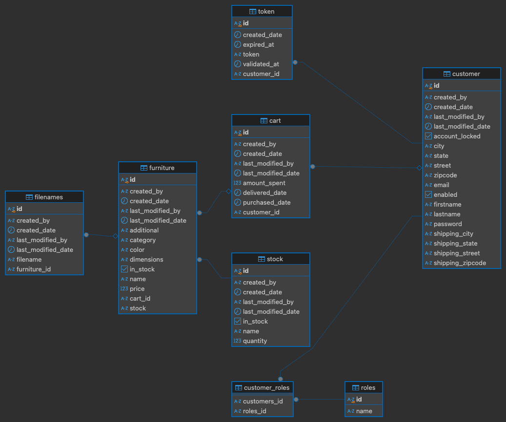

# Shop-Inn
***
**Table of content:**
- [Overview](#overview)
- [Features](#features)
- [Class Diagram](#class-diagram)
***

### Overview
 This is a backend service to help customers manage their purchases. This application is built using Spring 
 Boot 3 and Spring Security 6. The application offers features such as user registration, email validation,
 and purchasing management capabilities including item processing notification, shipment notification, and 
 delivery notifications through emails leveraging Kafka technologies. The application adheres to best practices
 in designing a RESTFul API and ensures security using JWT tokens. Angular is used to craft a front end page
 for account activation purpose.
***

### Features

- **User Registration:** New users can create account
- **User Authentication:** Existing users can access the account
- **User Authorization:** Access to resources are based on user roles
- **Email Validation:** For account activation by new users
- **Email Notifications:** User are notified about the processing, shipment and delivery of purchases
- **Purchase Items:** User are able to select item(s) for purchase
- **Return Items:** User are able to return new purchased items.

#### Class Diagram

